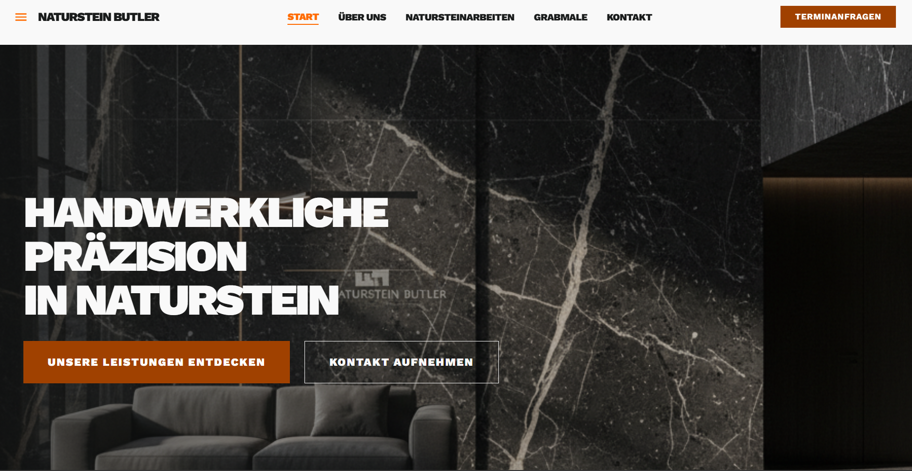
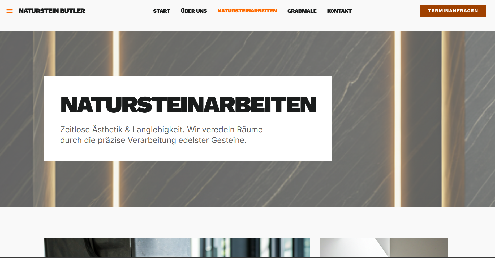
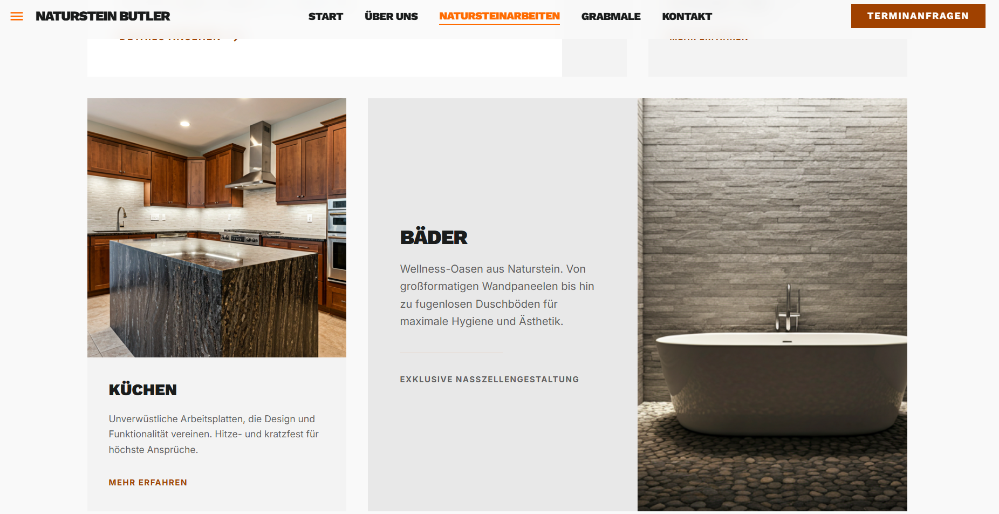
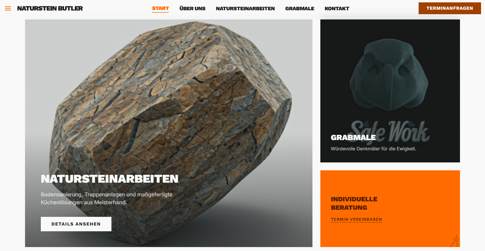
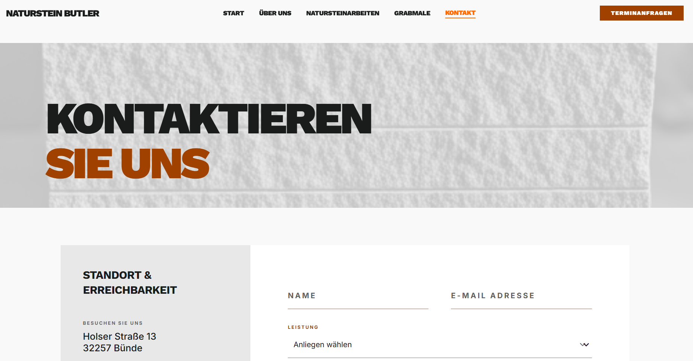

# Naturstein Butler - Webauftritt

Branche: Steinmetz / Handwerk / Lokales Gewerbe
---
## Umgesetzt
- Fünfseitiger Webauftritt (Startseite, Über uns, Natursteinarbeiten, Grabmale, Kontakt) mit konsistentem Design-System auf Basis einer definierten Farbpalette und Typografiehierarchie
- Asymmetrisches Bento-Grid-Layout für die Leistungsseite - priorisiert visuelle Hierarchie nach Dienstleistungsrelevanz
- Kontaktformular mit floating Labels und kategorisiertem Service-Dropdown (Natursteinarbeiten, Grabmale, Beratung, Terminanfrage)
- Vollständig responsives Layout - mobile-first, mit strukturierten Breakpoints für Tablet (md) und Desktop (lg)
- Semantisches HTML5 mit korrekter Überschriftenhierarchie, verknüpften Formular-Labels und beschreibenden Alt-Attributen
---
## Tech Stack

- Vanilla JavaScript
- Google Fonts: Work Sans (Headlines), Inter (Body)
- Material Symbols Outlined (Icons)
- HTML5 / CSS3
- Tailwind CSS v3 (CDN, inkl. Forms-Plugin und Container-Queries)
---
## Projektstruktur

  
   
  
   
  
   

